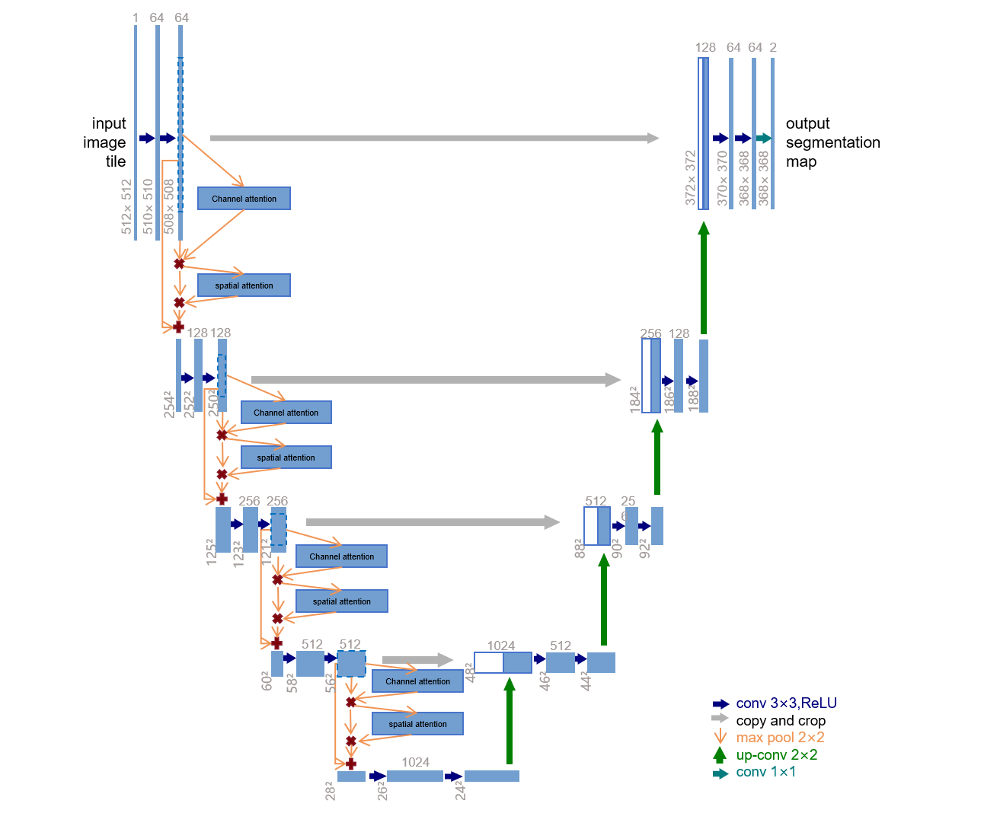
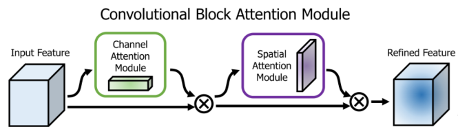
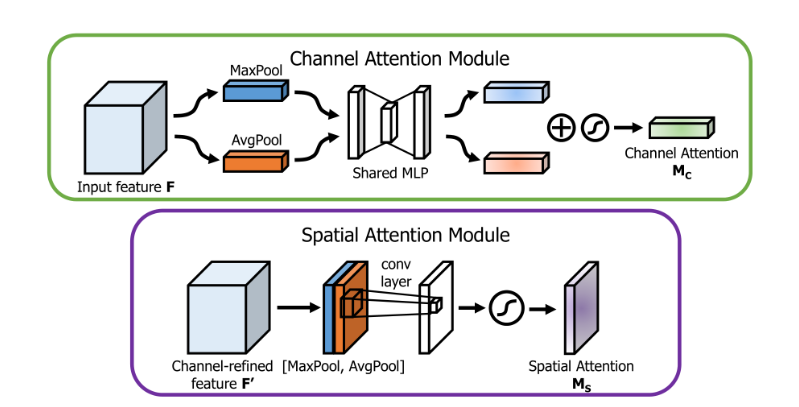

# 基于注意力机制改进的UNet模型语义分割冠状血管
本项目使用基于通道注意力和空间注意力改进的U-Net对XCAD数据集上的冠状血管造影图像进行语义分割
出自于北京邮电大学计算机学院夏令营9组 柴铠琰

## 模型架构


我通过在U-Net模型的下采样部分，在每个最大池化（max pool）之前添加注意力通道注意力和空间注意力，
使模型可以在横向和纵向增强重要部分的感知能力，从而提升模型的训练效果



通道注意力模块和空间注意力模块使用串联的方法进行添加（也可以使用并联方法添加，效果类似），两个模块的具体实现细节如下图展示：



## 目录结构
```angular2html
|-- U-Net_Attention
    |-- readme.md
    |-- requirements.txt
    |-- Model
    |   |-- Attention.py
    |   |-- best_model_Attention_200epoch.pth
    |   |-- ceshi.py
    |   |-- dataset.py
    |   |-- evaluation_metrics.png
    |   |-- evaluation_metrics_200.png
    |   |-- Model_see.py
    |   |-- predict.py
    |   |-- tophat15.jpg
    |   |-- tophat7.jpg
    |   |-- tophat_multi15.jpg
    |   |-- tophat_multi25.jpg
    |   |-- Top_Hat.png
    |   |-- Top_Hat_dataprocess.py
    |   |-- train.py
    |   |-- training_loss.png
    |   |-- training_loss_200.png
    |   |-- unet_model.py
    |   |-- unet_parts.py
    |   |-- yuchuli.py
    |-- XCAD
    |   |-- test
    |   |   |-- images
    |   |   |-- masks
    |   |   |-- res_predict
    |   |-- train
    |       |-- images
    |       |-- masks
    |       |-- Top_Hat
```

## 项目文件说明
### Model文件夹
> best_model.pth文件保存了模型训练的参数，可用于预测

> best_model_150.pth文件保存了模型训练150轮的参数，可用于预测

> clear_res.py用于清理模型预测生成的图像，帮助实现重复实验快速进行

> dataset.py用于加载数据，并对图像进行预处理 

> predict.py用于调用保存的模型参数进行预测

> trian.py用于训练

> unet_parts.py定义了U_Net网络的双卷积层、最大池化等结构模块，增强代码复用性

> unet_model.py定义了U-Net网络

> training_loss.png保存了训练的loss，用于模型评估

> evaluation_metrics.png保存了P值、R值和F1分数，用于模型评估

### XCAD文件夹
#### trian文件夹
保存了训练图像和mask
#### test文件夹
```angular2html
|-- test
    |   |   |-- images #测试集图像
    |   |   |-- masks  #测试集图像对应的mask
    |   |   |-- res    #模型预测输出
    |   |   |-- res_predict_150  #训练150轮的模型预测输出
    |   |   |-- res_predict_50   #训练50轮的模型预测输出
```


## Run
1. 首先配置运行环境，安装项目运行的包
```bash
    pip install -r requirements.txt
``` 

2. 修改项目文件中的路径，包括train.py,predict.py,ceshi.py,dataset.py等文件
3. 运行dataset.py文件，检查数据集等一系列设置是否正确
```bash
    python dataset.py
```
4. 在trian.py中设置训练参数

5. 运行trian.py文件
```bash
    python trian.py
```
# chaikaiyan_UNet_Attention
